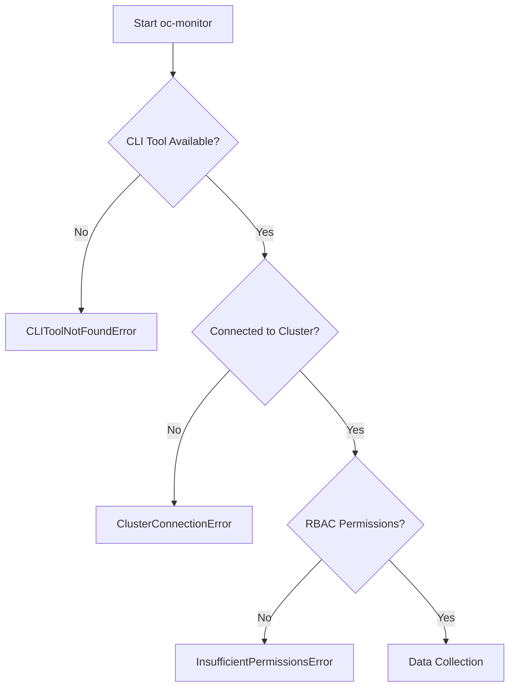

# OC Monitor - Interaction and Usage Workflow

## Overview

**OC Monitor** is an intelligent CLI agent for monitoring resources in OpenShift/Kubernetes clusters, with automatic overcommitment detection and AI-powered analysis (Claude Sonnet 4.5).

### Key Features
- Automatic collection of node and pod metrics
- CPU and memory overcommitment detection
- Visual analysis with color coding and progress bars
- Claude AI integration for contextual recommendations
- Output in formatted terminal or JSON (for automation)
- Risk score calculation per node and cluster

---

## Architecture and Components

### Data Structure

```
NodeMetrics
├── name: str
├── cpu: ResourceMetrics
│   ├── allocatable: float
│   ├── requests: float
│   └── limits: float
├── memory: ResourceMetrics
│   ├── allocatable: float
│   ├── requests: float
│   └── limits: float
├── pod_count: int
├── status: NodeStatus (HEALTHY/WARNING/OVERCOMMITTED)
└── risk_score: float (0-100)
```

### Status Classification

| Status | Condition | Threshold |
|--------|----------|-----------|
| **HEALTHY** | request_ratio ≤ 85% | ✅ Normal |
| **WARNING** | 85% < request_ratio ≤ 100% | ⚠️ Attention |
| **OVERCOMMITTED** | request_ratio > 100% | 🔴 Critical |

### Risk Score Calculation

```
risk_score = (cpu_request_ratio * 50) + (memory_request_ratio * 50)
- Maximum: 100
- Node with 100% CPU + 100% Memory = 100 risk score
- Node with 50% CPU + 50% Memory = 50 risk score
```

---

## Execution Flow

### 1. Initialization and Validation



### 2. Cluster Data Collection

```bash
# Commands executed internally
oc get nodes -o json                    # List all nodes
oc get pods -A -o json                  # List all pods
```

**Data collected per node:**
- CPU allocatable, requests, limits
- Memory allocatable, requests, limits
- Pod count
- Scheduling status

### 3. Processing and Analysis

```python
# For each node
1. Calculate allocatable resources
2. Aggregate requests/limits from all pods
3. Calculate ratios (request/allocatable)
4. Determine status (HEALTHY/WARNING/OVERCOMMITTED)
5. Calculate risk score
```

### 4. Overcommitment Detection

```python
# Node categorization
- overcommitted: nodes with ratio > 100%
- warning: nodes with ratio between 85-100%
- healthy: nodes with ratio < 85%
- cluster_risk: average of risk scores
```

### 5. AI Analysis (Optional)

If `--ai` enabled and `ANTHROPIC_API_KEY` configured:

**Prompt sent to Claude:**
- Cluster summary (node count by status)
- Details for each node (CPU, memory, pods, risk score)
- Request for structured analysis

**Expected response:**
1. CRITICAL ISSUES: problems needing immediate attention
2. RISK ASSESSMENT: risks under load
3. RECOMMENDATIONS: specific prioritized actions
4. PATTERNS: concerning trends and configurations

### 6. Output Rendering

**Terminal Mode:**
- Header with title
- Summary with count by status
- Node table with visual bars
- AI analysis (if enabled)
- Footer with overall status

**JSON Mode:**
- cluster_summary (counters and risk score)
- nodes[] (array with detailed metrics)
- ai_analysis (analysis text, if enabled)

---

## Use Cases

### 1. Manual Monitoring (Operator)

```bash
# Basic execution with AI analysis
./oc_monitor.py

# Expected output:
# - Colorful terminal visual
# - Node list sorted by risk score
# - Specific recommendations from Claude
# - Exit code: 0 (healthy), 1 (warning), 2 (overcommitted)
```

**When to use:**
- Performance troubleshooting
- Capacity planning
- Before large deployments
- Post-incident analysis

### 2. Automation and CI/CD

```bash
# JSON output for parsing
./oc_monitor.py --output json --no-ai > cluster_status.json

# In pipeline
if ./oc_monitor.py --output json --no-ai; then
    echo "Cluster healthy - proceeding with deployment"
else
    echo "Cluster issues detected - deployment blocked"
    exit 1
fi
```

**Exit Codes:**
- `0`: All nodes healthy
- `1`: Some nodes in warning state
- `2`: Nodes overcommitted (critical)
- `3`: CLI tool not found
- `4`: Connection error
- `5`: Insufficient permissions
- `6`: Generic monitor error
- `99`: Unexpected error

### 3. Multi-Cluster Monitoring

```bash
# Iterate through multiple contexts
for ctx in prod-east prod-west staging; do
    echo "=== Checking $ctx ==="
    ./oc_monitor.py --context $ctx --output json > "report_${ctx}.json"
done
```

### 4. Comparative Analysis (Threshold Tuning)

```bash
# Test different thresholds
./oc_monitor.py --threshold-warning 0.80 --threshold-critical 0.95

# For dev environments (more permissive)
./oc_monitor.py --threshold-warning 0.90 --threshold-critical 1.2
```

### 5. Debugging and Troubleshooting

```bash
# Maximum verbosity
./oc_monitor.py -vv

# Output:
# [DEBUG] Executing: oc get nodes -o json
# [DEBUG] Executing: oc get pods -A -o json
# ... executed commands and responses
```

---

## Command Line Interface

### Full Syntax

```bash
./oc_monitor.py [OPTIONS]
```

### Available Options

| Option | Type | Default | Description |
|-------|------|--------|-----------|
| `--context <name>` | string | current | Kubernetes context |
| `--output, -o` | choice | terminal | Format: `terminal` or `json` |
| `--threshold-warning` | float | 0.85 | Warning threshold (85%) |
| `--threshold-critical` | float | 1.0 | Critical threshold (100%) |
| `--ai / --no-ai` | flag | enabled | Enable AI analysis |
| `--api-key` | string | $ANTHROPIC_API_KEY | Anthropic API key |
| `--verbose, -v` | count | 0 | Verbosity (-v, -vv) |
| `--cli-tool` | choice | oc | CLI: `oc` or `kubectl` |

### Usage Examples

```bash
# 1. Basic execution (production)
./oc_monitor.py

# 2. Specific context
./oc_monitor.py --context prod-cluster-east

# 3. JSON without AI (for scripts)
./oc_monitor.py --output json --no-ai

# 4. Verbose debug
./oc_monitor.py -vv

# 5. Vanilla Kubernetes (not OpenShift)
./oc_monitor.py --cli-tool kubectl

# 6. Custom thresholds
./oc_monitor.py --threshold-warning 0.75 --threshold-critical 0.90

# 7. API key inline (not recommended)
./oc_monitor.py --api-key sk-ant-xxxxx

# 8. Multiple combined options
./oc_monitor.py --context staging --output json --no-ai -v
```

---

## Outputs and Interpretation

### Terminal Output

#### 1. Header
```
======================================================================
        OpenShift Cluster Resource Monitor (AI-Powered)
======================================================================
```

#### 2. Cluster Summary
```
📊 CLUSTER SUMMARY
──────────────────────────────────────────────────────────────────────
Total Nodes:           12
Overcommitted:         2  🔴
Warning State:         3  🟡
Healthy:              7  🟢
Overall Risk Score:   58/100
```

#### 3. Node Details Table
```
📋 NODE DETAILS
──────────────────────────────────────────────────────────────────────
Node Name              CPU Usage           Memory Usage        Status           Pods
─────────────────────  ──────────────────  ──────────────────  ───────────────  ────
worker-node-5          ████████ 113.8%     ████████░  90.6%   🔴 OVERCOMMITTED  110
worker-node-1          ████████ 118.8%     ████████░  93.8%   🔴 OVERCOMMITTED   87
worker-node-2          ███████░  90.0%     ██████░░  78.1%    🟡 WARNING         72
```

**Bar legend:**
- `█` = used
- `░` = available
- Green color: healthy
- Yellow color: warning
- Red color: overcommitted

#### 4. AI Analysis (Claude)
```
🤖 AI ANALYSIS (Claude Sonnet 4.5)
──────────────────────────────────────────────────────────────────────

CRITICAL ISSUES:
• worker-node-1 and worker-node-5 are severely overcommitted
• worker-node-1 has 118% CPU allocation
• Combined overcommit represents 23% of total capacity

RISK ASSESSMENT:
• IMMEDIATE: New pod deployments will fail
• SHORT-TERM: Pod evictions during memory pressure
• MEDIUM-TERM: Cluster upgrade path blocked

RECOMMENDATIONS (PRIORITIZED):
[CRITICAL - Next 4 hours]
1. Add 2 new worker nodes (16 core, 64GB)
2. Drain worker-node-1: oc adm drain worker-node-1
...

PATTERNS DETECTED:
• Node sizing imbalance (mixed 8/16 core workers)
• worker-node-5 at max pod count (110)
...
```

### JSON Output

```json
{
  "cluster_summary": {
    "total_nodes": 12,
    "overcommitted_count": 2,
    "warning_count": 3,
    "healthy_count": 7,
    "cluster_risk_score": 58.3
  },
  "nodes": [
    {
      "name": "worker-node-5",
      "status": "OVERCOMMITTED",
      "cpu_request_ratio": 1.138,
      "memory_request_ratio": 0.906,
      "pod_count": 110,
      "risk_score": 102.2
    }
  ],
  "ai_analysis": "CRITICAL ISSUES:\n• worker-node-1..."
}
```

**Main fields:**
- `cpu_request_ratio`: requests/allocatable ratio (1.0 = 100%)
- `memory_request_ratio`: requests/allocatable ratio
- `risk_score`: 0-100 (capped at 100)
- `status`: HEALTHY, WARNING, OVERCOMMITTED

---

## Decision Workflow (Based on Results)

### If Exit Code = 0 (HEALTHY)
```
✅ Cluster is healthy
→ Continue normal operations
→ Review AI analysis for preventive optimizations
```

### If Exit Code = 1 (WARNING)
```
⚠️ Cluster in attention state
→ Review WARNING nodes in table
→ Plan capacity additions
→ Implement Claude's medium-term recommendations
→ Increase monitoring frequency
```

### If Exit Code = 2 (OVERCOMMITTED)
```
🔴 Cluster in critical state
→ URGENT: Follow CRITICAL recommendations from AI
→ Add nodes immediately
→ Consider cordon/drain of overcommitted nodes
→ Block new deployments until resolved
→ Escalate to infrastructure team
```

### If Exit Code >= 3 (ERROR)
```
❌ Execution error
→ 3: Install oc/kubectl
→ 4: Check connection and kubeconfig
→ 5: Check RBAC permissions (ClusterRole)
→ 6+: Check logs with -vv
```

---

## External System Integrations

### 1. Prometheus/Grafana
```bash
# Export metrics periodically
*/5 * * * * /path/to/oc_monitor.py --output json > /var/metrics/cluster.json
```

### 2. Slack Alerting
```bash
#!/bin/bash
RESULT=$(./oc_monitor.py --output json)
EXIT_CODE=$?

if [ $EXIT_CODE -eq 2 ]; then
    curl -X POST $SLACK_WEBHOOK \
        -H 'Content-Type: application/json' \
        -d "{\"text\": \"🔴 CLUSTER OVERCOMMITTED!\n\`\`\`$RESULT\`\`\`\"}"
fi
```

### 3. ServiceNow Ticket Automation
```python
import subprocess
import json
import requests

result = subprocess.run(['./oc_monitor.py', '--output', 'json'],
                       capture_output=True, text=True)
data = json.loads(result.stdout)

if data['cluster_summary']['overcommitted_count'] > 0:
    # Create ServiceNow incident
    create_incident({
        'severity': 1,
        'description': f"Cluster overcommit: {data['ai_analysis']}"
    })
```

### 4. Git-Based Reporting
```bash
# Daily report commit
./oc_monitor.py --output json > "reports/$(date +%Y-%m-%d).json"
git add reports/
git commit -m "Daily cluster report $(date +%Y-%m-%d)"
git push
```

---

## RBAC Permission Requirements

### Minimum ClusterRole

```yaml
apiVersion: rbac.authorization.k8s.io/v1
kind: ClusterRole
metadata:
  name: oc-monitor-reader
rules:
- apiGroups: [""]
  resources: ["nodes", "pods"]
  verbs: ["get", "list"]
```

### ClusterRoleBinding

```yaml
apiVersion: rbac.authorization.k8s.io/v1
kind: ClusterRoleBinding
metadata:
  name: oc-monitor-binding
subjects:
- kind: ServiceAccount
  name: monitor-sa
  namespace: monitoring
roleRef:
  kind: ClusterRole
  name: oc-monitor-reader
  apiGroup: rbac.authorization.k8s.io
```

---

## Troubleshooting

### Problem: "CLI tool not found"
```bash
# Solution: Install oc or kubectl
# OpenShift
curl -LO https://mirror.openshift.com/pub/openshift-v4/clients/oc/latest/linux/oc.tar.gz
tar -xvf oc.tar.gz && sudo mv oc /usr/local/bin/

# Kubernetes
curl -LO "https://dl.k8s.io/release/$(curl -L -s https://dl.k8s.io/release/stable.txt)/bin/linux/amd64/kubectl"
sudo install -o root -g root -m 0755 kubectl /usr/local/bin/kubectl
```

### Problem: "Cannot connect to cluster"
```bash
# Check current context
oc config current-context
kubectl config current-context

# List available contexts
oc config get-contexts

# Test connectivity
oc whoami
oc get nodes
```

### Problem: "Insufficient permissions"
```bash
# Check current permissions
oc auth can-i list nodes
oc auth can-i list pods --all-namespaces

# Request permissions from admin
oc adm policy add-cluster-role-to-user cluster-reader $(oc whoami)
```

### Problem: "AI analysis failed"
```bash
# Verify API key
echo $ANTHROPIC_API_KEY

# Test without AI
./oc_monitor.py --no-ai

# Pass API key manually
./oc_monitor.py --api-key sk-ant-xxxxx
```

---

## Best Practices

### 1. Regular Execution
```bash
# Daily cron job
0 9 * * * /usr/local/bin/oc_monitor.py --output json > /var/log/cluster/daily_$(date +\%Y\%m\%d).json
```

### 2. Pre-Deployment Checks
```bash
# In deployment scripts
if ! ./oc_monitor.py --no-ai --output json | jq -e '.cluster_summary.overcommitted_count == 0'; then
    echo "ERROR: Cluster overcommitted, deployment blocked"
    exit 1
fi
```

### 3. Threshold Tuning by Environment
```bash
# Production (conservative)
./oc_monitor.py --threshold-warning 0.75 --threshold-critical 0.85

# Staging (standard)
./oc_monitor.py --threshold-warning 0.85 --threshold-critical 1.0

# Dev (permissive)
./oc_monitor.py --threshold-warning 0.95 --threshold-critical 1.2
```

### 4. API Key Security
```bash
# Use environment variable
export ANTHROPIC_API_KEY="sk-ant-xxxxx"

# Or protected config file
echo "export ANTHROPIC_API_KEY='sk-ant-xxxxx'" > ~/.oc_monitor_config
chmod 600 ~/.oc_monitor_config
source ~/.oc_monitor_config
```

---

## Demo Mode

To test without connecting to a real cluster:

```bash
./demo_oc_monitor.py
```

**What the demo does:**
- Creates 12 simulated nodes (3 masters + 9 workers)
- 2 nodes OVERCOMMITTED
- 3 nodes WARNING
- 7 nodes HEALTHY
- Generates sample AI analysis
- Shows terminal + JSON output

---

## Automated Testing

```bash
# Run test suite
pytest test_monitor.py -v

# Tests included:
# - Resource quantity parsing (CPU millicores, memory)
# - Ratio and percentage calculations
# - Status classification (HEALTHY/WARNING/OVERCOMMITTED)
# - Risk score calculation
# - Overcommitment detection
# - Output formatting
```

---

## Dependencies

```python
# requirements.txt
click>=8.0.0          # CLI framework
colorama>=0.4.0       # Terminal colors
tabulate>=0.9.0       # Table rendering
anthropic>=0.18.0     # Claude AI integration
```

```bash
pip install -r requirements.txt
```

---

## Roadmap and Future Extensions

1. **Metrics History**: Store trends over time
2. **Proactive Alerts**: Webhook integration (Slack, PagerDuty)
3. **Scaling Recommendations**: HPA/VPA config suggestions
4. **Pod-Level Analysis**: Drill-down into specific pods
5. **Cost Analysis**: Integration with billing/cost data
6. **Multi-Cluster Dashboard**: Aggregated view of multiple clusters

---

## Support and Documentation

- **Source Code**: [oc_monitor.py](oc_monitor.py)
- **Demo**: [demo_oc_monitor.py](demo_oc_monitor.py)
- **Tests**: [test_monitor.py](test_monitor.py)
- **Issues**: Report bugs and suggestions via GitHub Issues

---

## License and Contributions

This is an open-source project.
